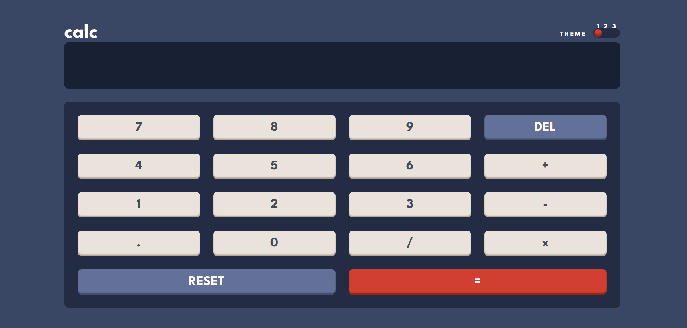
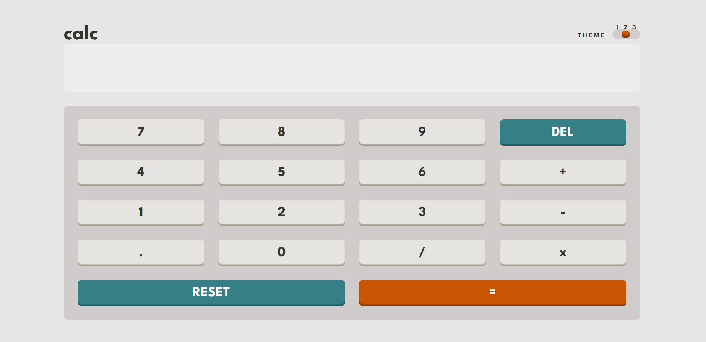
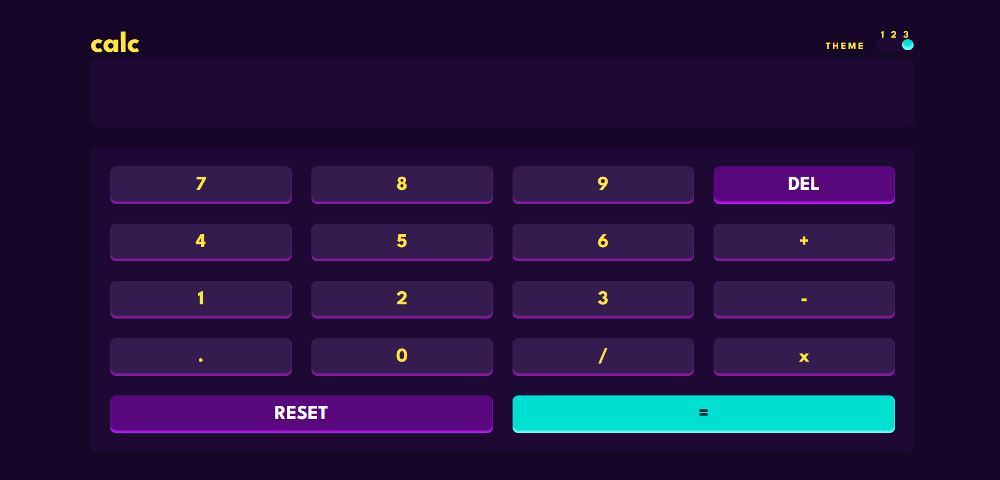

# Frontend Mentor - Calculator app solution

This is a solution to the [Calculator app challenge on Frontend Mentor](https://www.frontendmentor.io/challenges/calculator-app-9lteq5N29). Frontend Mentor challenges help you improve your coding skills by building realistic projects. 

## Table of contents

- [Overview](#overview)
  - [Screenshot](#screenshot)
  - [Links](#links)
- [My process](#my-process)
  - [Built with](#built-with)
  - [What I learned](#what-i-learned)
  - [Continued development](#continued-development)
- [Author](#author)
- [Acknowledgments](#acknowledgments)

**Note: Delete this note and update the table of contents based on what sections you keep.**

## Overview

### Screenshot

**THEME 1**


**THEME 2**


**THEME 3**


### Links

- Solution URL: [Add solution URL here](https://your-solution-url.com)
- Live Site URL: [Add live site URL here](https://your-live-site-url.com)

## My process

### Built with

- Semantic HTML5 markup
- CSS custom properties
- Flexbox
- CSS Grid
- [React](https://reactjs.org/) - JS library
- [Styled Components](https://styled-components.com/) - For styles

**Note: These are just examples. Delete this note and replace the list above with your own choices**

### What I learned
I added the comments for readability and for easy navigation.
Because there were a lot of code on the screen and I wanted to go to a particular place, with the comment I could just search and easily find it. Also create a state that handles an object for all the color changes in each theme. 
```js
  {/* Example */}
    const [changes, setChanges] = useState({
        mainBgColor: null, // For the main backgorund
        textColor: null, // Color of all the texts
        keyPad_ToggleBgColor: null, // Background for the toggle button and the keypad
        screenBgColor: null, // Background for the screen
        keyBgColor: null, // Background for the keys
        keyColor: null, // Color of the text on the keys e.g., 1,2,3 etc
        keyShadow: null, // Shadow for each key e.g., 0-9, operators, and point
        del_Reset_BgColor: null, // Background color for DELETE & RESET KEY
        del_Reset_Equal_TextColor: null, // Color for DELETE, RESET & EQUAL SIGN KEY
        del_ResetShadow: null, // Shadow for DELETE & RESET key
        equal_Toggle_BgColor: null, // Background color for EQUAL SIGN KEY
        equalShadow: null, // Shadow for EQUAL SIGN KEY
        equalTextColor: null // Color for EQUAL SIGN KEY
    });
``` 

### Continued development
Am still practicing on using the Context API provided by React, and some other hooks.

**Note: Delete this note and the content within this section and replace with your own plans for continued development.**


## Author

<!-- - Website - [Add your name here](https://www.your-site.com) -->
- Frontend Mentor - [@AshongAbdallah06](https://www.frontendmentor.io/profile/AshongAbdallah06)
- Twitter - [@XuGaR_2_0_0_6](https://twitter.com/XuGaR_2_0_0_6)
